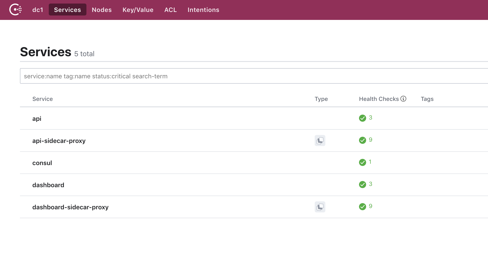
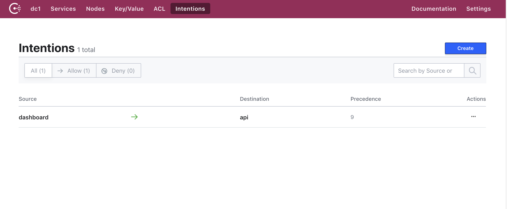

# Example code for SMI webinar

## Creating a Kubernetes Cluster in AKS

1. To run the Terraform code you first need to create a Service Principal in Azure and set the correct value as 
   environment variables. Full details can be found in the following guide 
   [https://www.terraform.io/docs/providers/azurerm/auth/service_principal_client_secret.html](https://www.terraform.io/docs/providers/azurerm/auth/service_principal_client_secret.html)

2. In addition to setting the standard variables the AKS resource requires the client id and client secret in order to create
   public load balancers. These are configured through the two Terraform variables CLIENT_ID and CLIENT_SECRET. 
   For convenience you can set these as environment variables, the full list of variables should look like the following
   example.

```
export ARM_CLIENT_ID="0000-0000-0000-0000"
export ARM_CLIENT_SECRET="0000-0000-0000-0000"
export ARM_SUBSCRIPTION_ID="0000-0000-0000-0000"
export ARM_TENANT_ID="0000-0000-0000-0000"

export TF_VAR_CLIENT_ID="${ARM_CLIENT_ID}"
export TF_VAR_CLIENT_SECRET="${ARM_CLIENT_SECRET}"
```

3. Once the environment variables are set you run the terraform apply command to create the resources.

```
$ cd terraform
$ terraform apply

An execution plan has been generated and is shown below.
Resource actions are indicated with the following symbols:
  + create

Terraform will perform the following actions:

  + module.aks.azurerm_resource_group.main
      id:                                                     <computed>
      location:                                               "westus2"
      name:                                                   "consul-resources"
      tags.%:                                                 <computed>

...

Apply complete! Resources: 6 added, 0 changed, 0 destroyed.

Outputs:

client_certificate = LS0tLS1CRUdJTiBDRVJUSUZJQ0FURS0tLS0tCk1JSUUvVENDQXVXZ0F3SUJBZ0lSQVAxYU9PekFaWFJNSElEc1ozOHEwLzR3RFFZSktvWklodmNOQVFFTEJRQXcKRFRFTE1Ba0dBMVVFQXhNQ1kyRXdIa

...
```


## Installing Consul

1. Installing Consul is performed using the Helm chart in this repository, before running the helm chart you need to 
   fetch a Kubernetes config file which allows you to interact with the cluster. This can be obtained by using the
   helper script in the root of this repo. The config will be output to the current folder in a file named kube_config.yml

```
$ ./helper get_k8s_config
Fetching Kubernetes configuration
```

2. Once you have the config file you can set the path to an environment variable `KUBECONFIG` so that it can be used
   by `kubectl` and `helm`.

```
export KUBECONFIG=<path>/kube_config.yml
```

3. To use the helm chart you need to have the `helm` cli tool installed, this can be found at [https://helm.sh/](https://helm.sh/).

4. The helm chart is pre-configured with default values, however to use Consul connect you need to override some of these
   values to enable the connect feature and Kubernetes annotations. These values are already configured in the file consul-helm/values.yml

```
global:
  bootstrapACLs: true

server:
  replicas: 1
  bootstrapExpect: 1
  connect: true

client:
  grpc: true

connectInject:
  enabled: true

ui:
  enabled: true
  service:
    enabled: true

centralConfig:
  enabled: true
  proxyDefaults: |
    {
      "envoy_dogstatsd_url": "udp://127.0.0.1:9125"
    }
```

5. Before installing Consul with Helm we need to create a service account called `tiller` which has the required permissions
   to interact with the Kuberentes cluster, you can then initialize Helm in the cluster.

```
$ cd consul-helm

$ kubectl apply -f tiller_role_binding.yml
serviceaccount/tiller created
clusterrolebinding.rbac.authorization.k8s.io/tiller created

$ helm init --service-account=tiller
$HELM_HOME has been configured at /Users/nicj/.helm.

Tiller (the Helm server-side component) has been installed into your Kubernetes Cluster.

Please note: by default, Tiller is deployed with an insecure 'allow unauthenticated users' policy.
To prevent this, run `helm init` with the --tiller-tls-verify flag.
For more information on securing your installation see: https://docs.helm.sh/using_helm/#securing-your-helm-installation
```

6. Installing Consul using the Helm chart can be done using the following command:

```
$ helm install -n consul -f consul-helm-master/values.yml -f values.yml consul-helm-master
kNAME:   consul
LAST DEPLOYED: Wed Jun 19 11:45:49 2019
NAMESPACE: default
STATUS: DEPLOYED

...

NOTES:

Thank you for installing HashiCorp Consul!

Now that you have deployed Consul, you should look over the docs on using
Consul with Kubernetes available here:

https://www.consul.io/docs/platform/k8s/index.html


Your release is named consul. To learn more about the release, try:

  $ helm status consul
  $ helm get consul
```

6. Consul will take a couple of minutes to complete installing, once all the pods are running you can view the interface
   using the following command. Consul's API and the UI are not exposed publically, however we can create a proxy
   using kubectl.

```
$ cd <repo root>
$ ./helper consul
ACL Token for Accessing Consul: bb94928c-0909-e264-9049-b78720c1bf66

Opening consul-consul-ui, To quit, press Ctrl-C
Forwarding from 0.0.0.0:8180 -> 8500
```

7. The Consul server installed with the Helm chart has the Consul ACL system enabled, this limits the access to the server
   based on the current users permissions defined by an ACL token. Details on the ACL system can be found in the following
   guide: [https://learn.hashicorp.com/consul/security-networking/production-acls](https://learn.hashicorp.com/consul/security-networking/production-acls)


## Installing the SMI Controller

1. In order to use SMI CRD's the Consul SMI Controller needs to be installed and since the ACL system has been configured
   in Consul the Controller requires an ACL Token in order to use Consul's APIs.  This can be created with the following command,
   remember to replace <token> with a valid ACL token. The ./helper consul command outputs the ACL master token when run.

```
$ curl -H "X-Consul-Token: <token>" localhost:8180/v1/acl/token -XPUT -d '{
   "Description": "Agent token for 'node1'",
   "Policies": [
      {
         "Name": "global-management"
      }
   ],
   "Local": false
}'
{"AccessorID":"0d26839c-45ad-bc25-5686-4e14af2d8d84","SecretID":"9d40b0e0-2f6f-a002-118c-c4b5c28e2c1e","Description":"Agent token for node1","Policies":[{"ID":"00000000-0000-0000-0000-000000000001","Name":"global-management"}],"Local":false,"CreateTime":"2019-06-19T11:13:46.613148797Z","Hash":"jRNpF3zrrEdN0T8lay1wsIgyBiD4dyJk7VNSjNDrUIw=","CreateIndex":221,"ModifyIndex":221}% 
```

2. The output from the previous command contains a new ACL token which can be used by the SMI controller, copy the SecretID from this output and 
   create a new Kubernetes secret.

```
kubectl create secret generic consul-smi-acl-token --from-literal=token=<SecretID from previous output>

secret/consul-smi-acl-token created
```

3. Once the secret has been created you can then deploy the SMI controller.

```
$ cd smi/
$ kubectl apply -f consul-smi-controller.yaml
customresourcedefinition.apiextensions.k8s.io/traffictargets.access.smi-spec.io created
customresourcedefinition.apiextensions.k8s.io/httproutegroups.specs.smi-spec.io created
customresourcedefinition.apiextensions.k8s.io/tcproutes.specs.smi-spec.io created
clusterrole.rbac.authorization.k8s.io/smi-controller created
clusterrolebinding.rbac.authorization.k8s.io/smi-controller created
serviceaccount/smi-controller created
deployment.apps/consul-smi-controller-deployment created
```

## Installing the application

1. The application consists of 4 Kubernetes config files:
  - **api.yml** - API component for the demo application
  - **dashboard.yml** - Frontend component for the demo application
  - **service.yml**  - Public loadbalancer for the Dashboard
  - **smi.yml** - SMI CRD's to configure Consul Intentions

2. Deploy these to Kubernetes

```
$ cd app
$ kubectl apply -f api.yml
serviceaccount/api created
deployment.apps/counting-api created


$ kubectl apply -f dashboard.yml
serviceaccount/dashboard created
deployment.apps/dashboard-deployment created


$ kubectl apply -f service.yml
service/counting-dashboard created


$ kubectl apply -f smi.yml
tcproute.specs.smi-spec.io/service-counting-tcp-route created
traffictarget.access.smi-spec.io/service-counting-targets created
```

3. All being well you should see the following services registered in the Consul UI



4. And the following intentions



5. You can open the application in your browser
   the IP address of the public loadbalancer can be found using the following command:

```
$ kubectl get svc counting-dashboard
NAME                 TYPE           CLUSTER-IP     EXTERNAL-IP     PORT(S)        AGE
counting-dashboard   LoadBalancer   10.0.124.194   13.66.186.202   80:32612/TCP   97s
```
